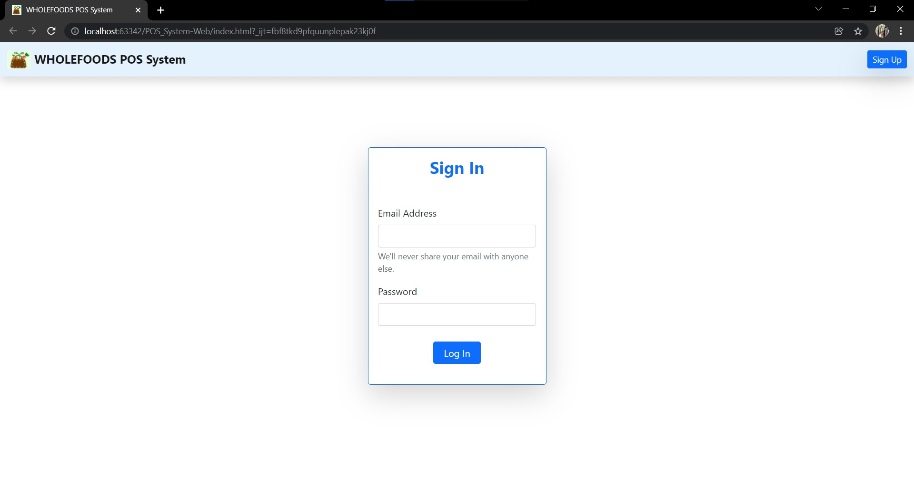
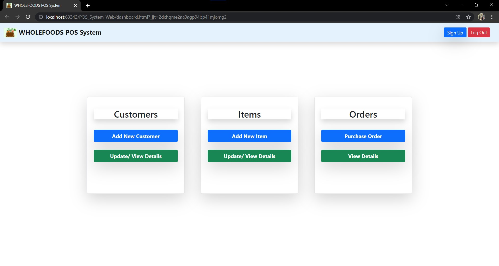
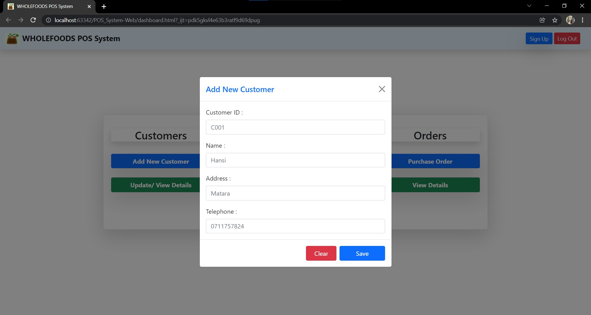
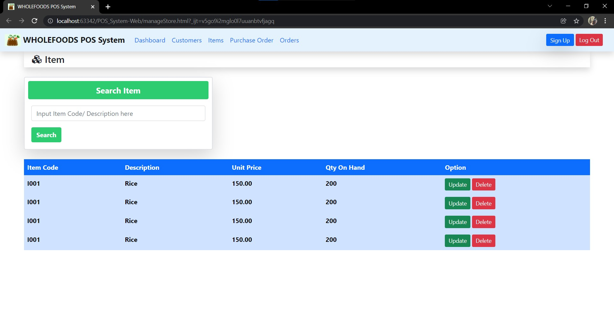

[![LinkedIn][linkedin-shield]][linkedin-url]
[![FaceBook][faceBook-shield]][faceBook-url]
[![WhatsApp][whatsApp-shield]][whatsApp-url]

[linkedin-shield]: https://img.shields.io/badge/-LinkedIn-black.svg?style=for-the-badge&logo=linkedin&colorB=555
[linkedin-url]: https://www.linkedin.com/in/hansi-hashani-8a2540203

[faceBook-shield]: https://img.shields.io/badge/Facebook-3498db?style=for-the-badge&logo=facebook&logoColor=white
[faceBook-url]: https://www.facebook.com/hansi.hashani.75

[whatsApp-shield]: https://img.shields.io/badge/WhatsApp-25D366?style=for-the-badge&logo=whatsapp&logoColor=white
[whatsApp-url]: https://wa.me/+94711757824

## POS System
#### This is my very first Web Application.

### Technologies used
#### Languages
- Html
- CSS
#### Frameworks
- Bootstrap
### Screenshots of the Application
#### LogIn Page

#### Dashboard

#### Add New Customer Form

#### Customer Details Page

#### Add New Item Form

#### Item Details Page

